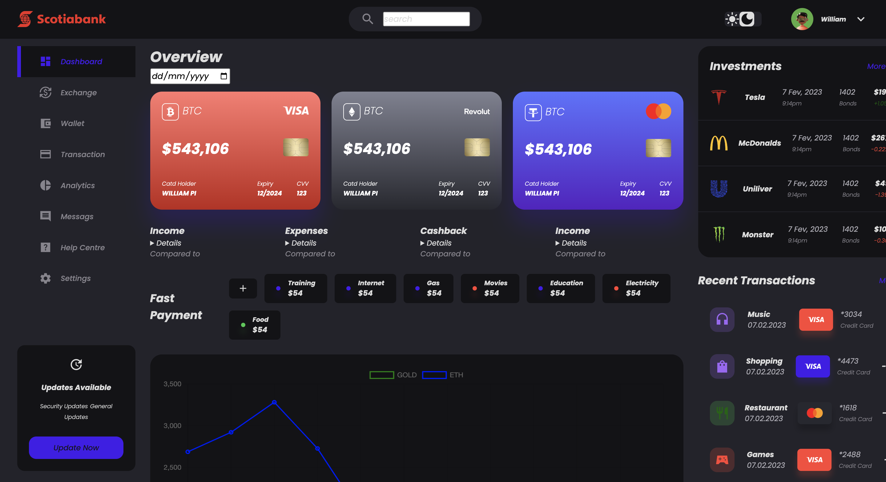

# Crypto Exchange Website - README

## Overview
A user-friendly crypto exchange dashboard for managing trades, wallets, transactions, and analytics with a clean interface.

## Features
- **Dashboard**: Account overview.  
- **Exchange**: Crypto trading.  
- **Wallet**: Manage balances.  
- **Transactions**: History tracking.  
- **Analytics**: Insights on income, expenses, and cashback.  
- **Messages**: Messaging section.  
- **Help Centre**: Support & FAQs.  
- **Settings**: User preferences.  

## Screenshots
_Add screenshots here to showcase the UI components and features._

**Dependencies**:  
- [`Chart.js`](https://www.chartjs.org)  
- Custom scripts (`dashboard.js`)

